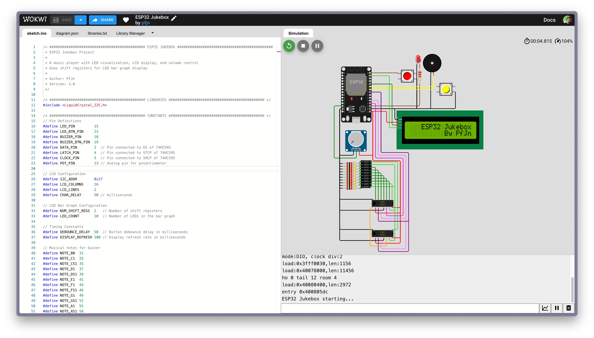
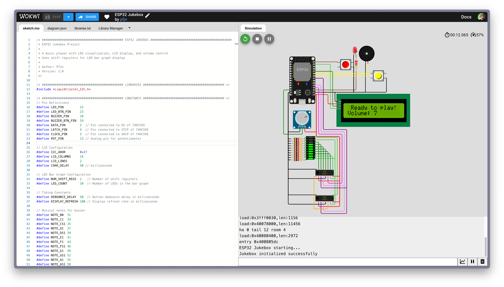

# ESP32-Jukebox

An interactive ESP32-based music player with LED visualization, LCD display, and volume control. This project demonstrates the capabilities of the ESP32 microcontroller for audio playback, visualization, and user interface control.

<div style="display: flex; align-items: center; justify-content: space-around; margin: 20px 0;">
  <div>
    
  </div>
  <div>
    
  </div>
</div>

## Try it online

You can try this project directly in your browser using the Wokwi simulator:

[**▶ Run ESP32 Jukebox in Wokwi**](https://wokwi.com/projects/369369062146905089)

## Features

- LED visualization through shift registers (74HC595) and bar graph display
- Interactive LCD menu system (I2C interface)
- Volume control via potentiometer
- Buzzer for music playback (Star Wars Imperial March demo)
- Control buttons for music playback and LED control
- Clean object-oriented architecture

## Hardware Components

- ESP32 DevKit board
- LCD1602 display with I2C interface
- 10-segment LED bar graph display
- Two 74HC595 shift registers
- Buzzer for audio output
- Potentiometer for volume control
- Push buttons for user interaction
- Status LED
- Various resistors for connections

## Software Architecture

The project is built using a modular, object-oriented approach with the following classes:

- `Button`: Handles button input with debouncing
- `Led`: Controls individual LEDs
- `Display`: Manages LCD display and text functions
- `ShiftRegister`: Handles communication with 74HC595 shift registers
- `Buzzer`: Controls sound output and melody playback
- `VolumeControl`: Manages potentiometer input and visualization
- `Jukebox`: Main controller class that coordinates all components

## Wiring Diagram

The project's wiring is defined in the [diagram.json](src/diagram.json) file, which is used by the Wokwi simulator to create the virtual hardware connections.

<div style="display: flex; align-items: center; justify-content: space-around; margin: 20px 0;">
  <div>
    <h3>Pin Connections</h3>
    <table>
      <thead>
        <tr>
          <th>Component</th>
          <th>ESP32 Pin</th>
        </tr>
      </thead>
      <tbody>
        <tr><td>Status LED</td><td>GPIO 15</td></tr>
        <tr><td>LED Button</td><td>GPIO 23</td></tr>
        <tr><td>Buzzer</td><td>GPIO 18</td></tr>
        <tr><td>Buzzer Button</td><td>GPIO 19</td></tr>
        <tr><td>Shift Register Data</td><td>GPIO 2</td></tr>
        <tr><td>Shift Register Latch</td><td>GPIO 4</td></tr>
        <tr><td>Shift Register Clock</td><td>GPIO 5</td></tr>
        <tr><td>Potentiometer</td><td>GPIO 13</td></tr>
        <tr><td>LCD I2C SCL</td><td>GPIO 22</td></tr>
        <tr><td>LCD I2C SDA</td><td>GPIO 21</td></tr>
      </tbody>
    </table>
  </div>
  <div>
    
  </div>
</div>

## How to Use

1. Power on the ESP32 board
2. The LCD will display the welcome message
3. Use the red button to toggle the status LED
4. Press the yellow button to play/stop the Star Wars theme
5. Adjust the potentiometer to control the volume level (displayed on the LED bar graph)

## Building the Project

### Prerequisites

Before getting started, you need the following software and libraries:

- [Arduino IDE](https://www.arduino.cc/en/software) (1.8.x or newer)
- [ESP32 board package](https://github.com/espressif/arduino-esp32#installation-instructions)
- [LiquidCrystal_I2C library](https://github.com/johnrickman/LiquidCrystal_I2C)

### Option 1: Run in Wokwi Simulator

The easiest way to try the project is in the Wokwi simulator:
1. Visit [https://wokwi.com/projects/369369062146905089](https://wokwi.com/projects/369369062146905089)
2. Click the "Start Simulation" button

### Option 2: Build with Arduino IDE

To build this project using the Arduino IDE:

1. Install the [Arduino IDE](https://www.arduino.cc/en/software)
2. Install the [ESP32 board package](https://github.com/espressif/arduino-esp32#installation-instructions)
3. Install the [LiquidCrystal_I2C library](https://github.com/johnrickman/LiquidCrystal_I2C) via the Library Manager
4. Clone this repository: git clone https://github.com/yourusername/ESP32-Jukebox.git


1. Open [src/sketch.ino](src/sketch.ino) in the Arduino IDE
2. Select your ESP32 board in the Arduino IDE
3. Connect the hardware according to the wiring diagram
4. Upload the sketch to your ESP32

### Option 3: Build with Visual Studio Code

For a more advanced development environment:

1. Install [Visual Studio Code](https://code.visualstudio.com/)
2. Install the [PlatformIO extension](https://marketplace.visualstudio.com/items?itemName=platformio.platformio-ide)
3. Clone this repository:

```
git clone https://github.com/yourusername/ESP32-Jukebox.git
```

4. Open the project folder in VSCode
5. Create a new `platformio.ini` file in the project root with the following content:

```ini
[env:esp32dev]
platform = espressif32
board = esp32dev
framework = arduino
lib_deps =
    marcoschwartz/LiquidCrystal_I2C @ ^1.1.4
monitor_speed = 115200
```

6. Move the sketch.ino code to a main.cpp file in the src folder
7. Build and upload using PlatformIO commands in VSCode

## Project Structure

- [src/sketch.ino](src/sketch.ino): Main Arduino sketch with all code
- [src/diagram.json](src/diagram.json): Wokwi simulator hardware configuration
- [src/libraries.txt](src/libraries.txt): Required libraries for the project
- [src/wokwi-project.txt](src/wokwi-project.txt): Wokwi project information

## Troubleshooting

Common issues and solutions:

- **LCD Not Displaying**: Verify I2C address (default is 0x27, but may be 0x3F for some modules)
- **Shift Register Issues**: Check data, latch, and clock connections
- **ESP32 Not Uploading**: Hold the BOOT button during upload initialization

## Extending the Project

Here are some ideas for extending this project:

- Add more songs to the music library
- Implement [MQTT](https://github.com/knolleary/pubsubclient) connectivity for remote control
- Add spectrum analyzer functionality for music visualization
- Include SD card support for loading custom songs
- Implement a web interface for controlling the jukebox
- Add Bluetooth connectivity for wireless control
- Create a mobile app companion for remote song selection
- Implement multi-room synchronization with multiple ESP32 devices

## Contributing

Contributions are welcome! Please feel free to submit a Pull Request.

## License

This project is licensed under the [GNU Affero General Public License v3.0](LICENSE).

## Author

Created by PfJn

---

*Note: This project was designed for educational purposes to demonstrate ESP32 capabilities.*